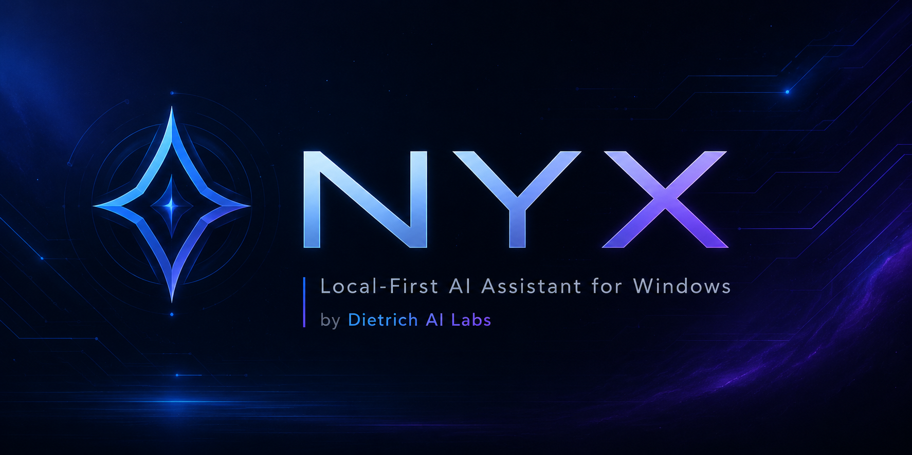

<p align="center">
  
</p>

# Nyx Windows Beta

Beta distribution repo for Nyx Windows releases by Dietrich AI Labs.

This repository is for beta testers. It is not the main source-code repository.

## Latest public download

**Current public beta:** Nyx Beta 1.0 RC5

- Download the release package: [Nyx_Beta_1_0_RC5_20260709_180632.zip](../../releases/latest/download/Nyx_Beta_1_0_RC5_20260709_180632.zip)
- View all releases: [Releases](../../releases)

The RC5 package includes:

- `Nyx_Beta_1.0_RC5_Setup.exe`
- `SHA256SUMS.txt`
- `RC5_PACKAGE_NOTES.txt`
- `RUN_INSTALLER_WITH_LOG.bat`
- `Nyx_Beta_1.0_RC5_silent_test_install.log`

Do not download random files from chat history, commit history, or old links if a newer release exists here.

## Current release status

Nyx Beta 1.0 RC5 is the current public release candidate package.

RC5 includes backend readiness/status polish and a fresh Inno Setup installer build from the current Windows executable. The installer package was staged from the valid RC5 build timestamp:

```text
20260709_180632
```

The earlier failed/fake-success package timestamp must not be used:

```text
20260709_175647
```

RC5 Backend Status refresh behavior is read-only. It must not start servers, install software, download models, switch backends, or edit settings.

## What this repo is for

- Downloading the latest Nyx Windows beta release package.
- Reading install instructions.
- Reading known issues and SmartScreen notes.
- Reporting tester feedback through GitHub Issues.

## Quick start

1. Open [Releases](../../releases), or use the latest download link above.
2. Download `Nyx_Beta_1_0_RC5_20260709_180632.zip`.
3. Extract the ZIP package.
4. Run `Nyx_Beta_1.0_RC5_Setup.exe`.
5. If Windows SmartScreen appears, choose **More info > Run anyway**.
6. Launch Nyx from the Start Menu or desktop shortcut if created.
7. Test using [TESTER_GUIDE.md](TESTER_GUIDE.md).
8. Report bugs under [Issues](../../issues) or by using the in-app **Bug Report** button.

Default install location:

```text
%LOCALAPPDATA%\Programs\Nyx
```

## What's new in RC5

- Updated Nyx public release stage to RC5.
- Updated About / Changelog wording to show RC5 as the current public release candidate.
- Added backend readiness/status polish for Ollama, llama.cpp / GGUF, and backend routing visibility.
- Improved backend status wording so setup state is easier for testers to understand.
- Preserved RC4 and earlier release history below the current RC5 changelog.
- Rebuilt the Windows executable from the current `C:\Nyx` source.
- Built a fresh RC5 Inno Setup installer instead of reusing old failed/archive installer scripts.
- Used the small setup icon to avoid prior Inno resource-size failures.
- Included SHA256 checksum and package notes for tester validation.

## Verified in RC5

- App executable rebuilt successfully.
- Inno Setup compiler found at the per-user install path.
- RC5 installer compiled successfully with Inno Setup 6.7.1.
- Silent install log shows the installation process succeeded.
- Silent install log shows `Nyx.exe` installed to the test install directory.
- About / Changelog shows RC5 public release candidate wording.
- `docs\CHANGELOG.md` matches the embedded changelog status in the app source.
- RC4 remains preserved as historical changelog content.
- Backend readiness/status polish is included.
- Cloud Connector remains disabled by default.
- Ollama remains the easiest default local backend.
- llama.cpp / GGUF remains optional for configured users.
- No old failed installer archive script is being treated as the RC5 source.

## Important beta notes

Nyx is beta software. Expect rough edges.

Current expected warnings:

- Windows SmartScreen may warn because this is not broadly trusted signed software yet.
- Antivirus may inspect or delay the installer because it is a new beta executable.
- First launch may still require Ollama setup or model download depending on the tester machine.
- GGUF / llama.cpp requires separate local configuration.
- Large local models may take time to load depending on hardware.
- Restore/Rollback is informational only.
- Audit Viewer is read-only metadata only.
- Hardware Auto-Detect is read-only metadata only.
- Backend Status is diagnostic/read-only.
- The app is Windows-focused right now.

## Do not

- Rehost modified beta ZIPs as official builds.
- Upload private files, credentials, keys, or sensitive business data during testing.
- Treat beta output as professional, medical, legal, or financial advice.

## Useful docs

- [INSTALL.md](INSTALL.md) — install steps.
- [TESTER_GUIDE.md](TESTER_GUIDE.md) — what to test.
- [KNOWN_ISSUES.md](KNOWN_ISSUES.md) — current expected rough edges.
- [SMARTSCREEN_NOTES.md](SMARTSCREEN_NOTES.md) — Windows warning explanation.
- [SECURITY_AND_PRIVACY.md](SECURITY_AND_PRIVACY.md) — beta safety notes.
- [CHANGELOG.md](CHANGELOG.md) — release notes history.
- [RELEASE_CHECKLIST.md](RELEASE_CHECKLIST.md) — maintainer release checklist.

## Project repos

Main source repo: [dietrichailabs-oss/Nyx](https://github.com/dietrichailabs-oss/Nyx).

Beta distribution repo: [dietrichailabs-oss/Nyx-Beta](https://github.com/dietrichailabs-oss/Nyx-Beta).

## Version

Latest public release candidate: `1.0.0-rc.5`

Release tag: `v1.0.0-rc.5`

Build package: `Nyx_Beta_1_0_RC5_20260709_180632`

Previous public release candidate: `1.0.0-rc4`
